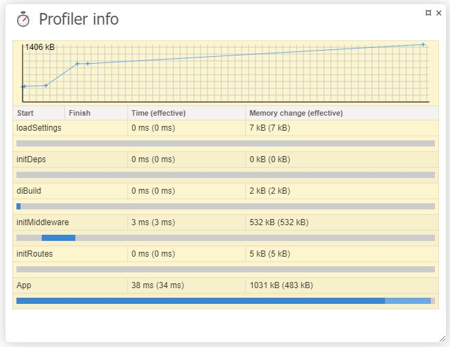

[](https://coveralls.io/github/semhoun/runtracy?branch=master)
[](https://codeclimate.com/github/semhoun/runtracy)
[![Latest Version on Packagist][ico-version]][link-packagist]
[![Total Downloads][ico-downloads]][link-downloads]
[![Software License][ico-license]][link-license]

# Slim Framework 4 Tracy Debugger Bar

configure it by mouse

***


now in package:

***

| Panel | Description |
| --- | --- |
| **Slim Framework** | - |
| Slim Environment | RAW data |
| Slim Container | RAW data |
| Slim Request | RAW data |
| Slim Response | RAW data |
| Slim Router | RAW data |
| **DB** | - |
| Doctrine [ORM](https://github.com/doctrine/doctrine2) or [DBAL](https://github.com/doctrine/dbal) | time, sql, params, types. panel & collector for both. **Note:** Need a Configuration instance available in DI, and must be the same used by Doctrine. |
| [Idiorm](https://github.com/j4mie/idiorm) | time, sql. panel & collector. **Note:** Idiorm support only one collector and if you use own this will not work. |
| [Illuminate Database](https://github.com/illuminate/database) | sql, bindings |
| **Template** | - |
| [Twig](https://github.com/twigphp/Twig) | \Twig\Profiler\Dumper\HtmlDumper() |
| **Common** | - |
| PanelSelector | easy configure (part of fork from [TracyDebugger](https://github.com/adrianbj/TracyDebugger)) |
| PhpInfo | full phpinfo() |
| Console | PTY (pseudo TTY) console (fork from [web-console](https://github.com/nickola/web-console)) |
| Profiler | time, mem usage, timeline (fork from [profiler](https://github.com/netpromotion/profiler)) |
| Included Files | Included Files list |
| XDebug | start and stop a Xdebug session (fork from [Nette-XDebug-Helper](https://github.com/jsmitka/Nette-XDebug-Helper)) |
| VendorVersions | version info from composer.json and composer.lock (fork from [vendor-versions](https://github.com/milo/vendor-versions)) |

***

# Install

**1.**

```bash
$ composer require semhoun/slim-racy
```

**2.** goto 3 or if need Twig, Doctrine DBAL, Doctrine ORM, Eloquent ORM then:

**2.1** install it

```bash
$ composer require doctrine/dbal
$ composer require doctrine/orm
$ composer require slim/twig-view
$ composer require illuminate/database
```

**2.2** add to your dependencies (Twig, Twig\_Profiler) and/or Eloquent ORM like:

```php
// Twig
$c['twig_profile'] = function () {
    return new \Twig\Profiler\Profile();
};

$c['view'] = function ($c) {
    $settings = $c->get('settings')['view'];
    $view = new \Slim\Views\Twig::create($settings['template_path'], $settings['twig']);
    // Add extensions
    $view->addExtension(new \Twig\Extension\ProfilerExtension($c['twig_profile']));
    $view->addExtension(new \Twig\Extension\DebugExtension());
    return $view;
};

// Register Eloquent single connection
$capsule = new \Illuminate\Database\Capsule\Manager;
$capsule->addConnection($cfg['settings']['db']['connections']['mysql']);
$capsule->setAsGlobal();
$capsule->bootEloquent();
$capsule::connection()->enableQueryLog();

// Doctrine DBAL
$c['dbal'] = function () {
    $conn = \Doctrine\DBAL\DriverManager::getConnection(
        [
            'driver' => 'pdo_mysql',
            'host' => '127.0.0.1',
            'user' => 'dbuser',
            'password' => '123',
            'dbname' => 'bookshelf',
            'port' => 3306,
            'charset' => 'utf8',
        ],
        new \Doctrine\DBAL\Configuration
    );
    // possible return or DBAL\Query\QueryBuilder or DBAL\Connection
    return $conn->createQueryBuilder();
};

// Doctrine ORM
// this example from https://github.com/vhchung/slim3-skeleton-mvc
// doctrine EntityManager
$c['em'] = function ($c) {
    $settings = $c->get('settings');
    $config = \Doctrine\ORM\Tools\Setup::createAnnotationMetadataConfiguration(
        $settings['doctrine']['meta']['entity_path'],
        $settings['doctrine']['meta']['auto_generate_proxies'],
        $settings['doctrine']['meta']['proxy_dir'],
        $settings['doctrine']['meta']['cache'],
        false
    );
    // possible return or ORM\EntityManager or ORM\QueryBuilder
    return \Doctrine\ORM\EntityManager::create($settings['doctrine']['connection'], $config);
};
```

**3.** register middleware

```php
$app->add(SlimTracy\Middlewares\TracyMiddleware($app, $tracySettings));
```

**4.** register route if you plan use PTY Console

```php
$app->post('/console', 'SlimTracy\Controllers\SlimTracyConsole:index');
```

also copy you want `jquery.terminal.min.js` & `jquery.terminal.min.css`  from vendor/semhoun/runtracy/web and correct path in 'settings' below.
add from local or from CDN (https://code.jquery.com/) or copy/paste

```html
<script
    src="https://code.jquery.com/jquery-3.1.1.min.js"
    integrity="sha256-hVVnYaiADRTO2PzUGmuLJr8BLUSjGIZsDYGmIJLv2b8="
    crossorigin="anonymous"></script>
```

**5.** add to your settings Debugger initialisation and 'tracy' section.

```php
use Tracy\Debugger;

Debugger::enable(Debugger::DEVELOPMENT);

return [
    'settings' => [
                'addContentLengthHeader' => false// debugbar possible not working with true
    ... // ...
    ... // ...

        'tracy' => [
            'showPhpInfoPanel' => 0,
            'showSlimRouterPanel' => 0,
            'showSlimEnvironmentPanel' => 0,
            'showSlimRequestPanel' => 1,
            'showSlimResponsePanel' => 1,
            'showSlimContainer' => 0,
            'showEloquentORMPanel' => 0,
            'showTwigPanel' => 0,
            'showIdiormPanel' => 0,// > 0 mean you enable logging
            // but show or not panel you decide in browser in panel selector
            'showDoctrinePanel' => 'em',// here also enable logging and you must enter your Doctrine container name
            // and also as above show or not panel you decide in browser in panel selector
            'showProfilerPanel' => 0,
            'showVendorVersionsPanel' => 0,
            'showXDebugHelper' => 0,
            'showIncludedFiles' => 0,
            'showConsolePanel' => 0,
            'configs' => [
                // XDebugger IDE key
                'XDebugHelperIDEKey' => 'PHPSTORM',
                // Disable login (don't ask for credentials, be careful) values( 1 || 0 )
                'ConsoleNoLogin' => 0,
                // Multi-user credentials values( ['user1' => 'password1', 'user2' => 'password2'] )
                'ConsoleAccounts' => [
                    'dev' => '34c6fceca75e456f25e7e99531e2425c6c1de443'// = sha1('dev')
                ],
                // Password hash algorithm (password must be hashed) values('md5', 'sha256' ...)
                'ConsoleHashAlgorithm' => 'sha1',
                // Home directory (multi-user mode supported) values ( var || array )
                // '' || '/tmp' || ['user1' => '/home/user1', 'user2' => '/home/user2']
                'ConsoleHomeDirectory' => DIR,
                // terminal.js full URI
                'ConsoleTerminalJs' => '/assets/js/jquery.terminal.min.js',
                // terminal.css full URI
                'ConsoleTerminalCss' => '/assets/css/jquery.terminal.min.css',
                'ConsoleFromEncoding' => 'CP866', // or false
                'ProfilerPanel' => [
                    // Memory usage 'primaryValue' set as Profiler::enable() or Profiler::enable(1)
//                    'primaryValue' =>                   'effective',    // or 'absolute'
                    'show' => [
                        'memoryUsageChart' => 1, // or false
                        'shortProfiles' => true, // or false
                        'timeLines' => true // or false
                    ]
                ]
            ]
        ]
```

see config examples in vendor/semhoun/runtracy/Example


Profiler Example in [slim-skeleton-mvc](https://github.com/semhoun/slim-skeleton-mvc)
`public/index.php`

```php
<?php
use App\Services\Settings;
use DI\ContainerBuilder;

// Set the absolute path to the root directory.
$rootPath = realpath(__DIR__ . '/..');

// Include the composer autoloader.
include_once $rootPath . '/vendor/autoload.php';

SlimTracy\Helpers\Profiler\Profiler::enable();
SlimTracy\Helpers\Profiler\Profiler::start('App');

// At this point the container has not been built. We need to load the settings manually.
SlimTracy\Helpers\Profiler\Profiler::start('loadSettings');
$settings = Settings::load();
SlimTracy\Helpers\Profiler\Profiler::finish('loadSettings');

// DI Builder
$containerBuilder = new ContainerBuilder();

if (! $settings->get('debug')) {
    // Compile and cache container.
    $containerBuilder->enableCompilation($settings->get('cache_dir').'/container');
}

// Set up dependencies
SlimTracy\Helpers\Profiler\Profiler::start('initDeps');
$containerBuilder->addDefinitions($rootPath.'/config/dependencies.php');
SlimTracy\Helpers\Profiler\Profiler::finish('initDeps');

// Build PHP-DI Container instance
 SlimTracy\Helpers\Profiler\Profiler::start('diBuild');
$container = $containerBuilder->build();
SlimTracy\Helpers\Profiler\Profiler::finish('diBuild');

// Instantiate the app
$app = \DI\Bridge\Slim\Bridge::create($container);

// Register middleware
SlimTracy\Helpers\Profiler\Profiler::start('initMiddleware');
$middleware = require $rootPath . '/config/middleware.php';
$middleware($app);
SlimTracy\Helpers\Profiler\Profiler::finish('initMiddleware');

// Register routes
SlimTracy\Helpers\Profiler\Profiler::start('initRoutes');
$routes = require $rootPath . '/config/routes.php';
$routes($app);
SlimTracy\Helpers\Profiler\Profiler::finish('initRoutes');

// Set the cache file for the routes. Note that you have to delete this file
// whenever you change the routes.
if (! $settings->get('debug')) {
    $app->getRouteCollector()->setCacheFile($settings->get('cache_dir').'/route');
}

// Add the routing middleware.
$app->addRoutingMiddleware();

// Add Body Parsing Middleware
$app->addBodyParsingMiddleware();

// Run the app
$app->run();
SlimTracy\Helpers\Profiler\Profiler::finish('App');

```




***

## HOWTO

[how-open-files-in-ide-from-debugger](https://pla.nette.org/en/how-open-files-in-ide-from-debugger)

***

## Tests

```bash
$ cd vendor/semhoun/runtracy
$ composer update
$ vendor/bin/phpunit
```


## Credits

*   [https://github.com/runcmf/runtracy](https://github.com/runcmf/runtracy)

***

## License

```bash
Copyright 2024 nathanael@semhoun.net

Licensed under the Apache License, Version 2.0 (the "License");
you may not use this file except in compliance with the License.
You may obtain a copy of the License at

    http://www.apache.org/licenses/LICENSE-2.0

Unless required by applicable law or agreed to in writing, software
distributed under the License is distributed on an "AS IS" BASIS,
WITHOUT WARRANTIES OR CONDITIONS OF ANY KIND, either express or implied.
See the License for the specific language governing permissions and
limitations under the License.
```

[ico-version]: https://img.shields.io/packagist/v/semhoun/runtracy.svg

[ico-license]: https://img.shields.io/badge/license-Apache%202-green.svg

[ico-downloads]: https://img.shields.io/packagist/dt/semhoun/runtracy.svg

[link-packagist]: https://packagist.org/packages/semhoun/runtracy

[link-license]: http://www.apache.org/licenses/LICENSE-2.0

[link-downloads]: https://github.com/semhoun/runtracy
